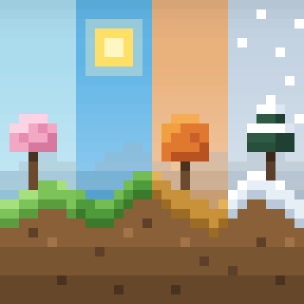

#  Seasonal Horizons 🌱 ☀️ 🍂 ❄️

Seasonal Horizons brings a changing year to Minecraft 1.7.10 and GT New Horizons. Spring, summer, autumn, and winter are each divided into early, mid, and late subseasons, giving the world twelve distinct seasonal stages.

## Features

- **Twelve seasonal stages:** every early, mid, and late subseason has its own grass and foliage colors.
- **Independent seasons per dimension:** seasons run only in configured dimensions and pause while a dimension is unloaded. The Overworld is enabled by default.
- **A colder winter:** seasonal temperatures let snow settle and surface water freeze in places that remain warm during the rest of the year.
- **Gradual accumulation and thaw:** physical snow layers and ice spread across the landscape over time instead of appearing everywhere at once, then melt when conditions warm.
- **Persistent seasonal state:** unloaded, newly generated, and newly active chunks catch up to the events they missed without forcing every chunk to stay loaded.
- **Life beneath the canopy:** snow and ice can form beneath leaves, icicles can hang from them wherever snow accumulates, and scattered leaf piles can appear below supported trees in autumn.
- **Configurable behavior:** choose which dimensions have seasons, set subseason and snow-update timing, and tune or disable canopy snow, icicles, and leaf piles.

Snow and ice are driven by the current season, temperature, altitude, and global weather. Cold areas can retain snow year-round, warm areas thaw year-round, and temperate areas follow the winter snow cycle.

## Requirements

- Minecraft 1.7.10 with Forge.
- [ChunkAPI](https://github.com/FalsePattern/ChunkAPI) and its dependency [FalsePatternLib](https://github.com/FalsePattern/FalsePatternLib).
- Install the mod on both the server and every client.

## Multiplayer

The server and every client must use the same `seasonalhorizons.cfg`. Some options register blocks (for example the list of leaves that produce leaf piles), and a client with different settings cannot join the server.

## Known limitations

- Biomes with their own color logic (swamp, mesa, roofed forest, Biomes O' Plenty biomes) keep their colors and do not change with the seasons.
- Only vanilla leaves produce leaf piles; modded leaves can be added into the config but might not work properly yet.
- Grass and foliage colors change instantly between subseasons instead of blending gradually.
- Seasonal snow follows the world-wide weather and does not check whether a biome normally has precipitation; seasons do not yet change which biomes get rain.
- Local weather mods such as SimpleClouds are not integrated yet.
- If a chunk's biome changes while it is loaded (world editors, biome-changing mods), snow and thaw keep using the old biome until the chunk is unloaded and loaded again.
- Distant Horizons terrain does not show seasonal snow yet.

## Distant Horizons

Seamless Distant Horizons support is planned. The goal is for distant terrain to follow the same gradual snow and thaw history as full-resolution chunks, without rebuilding every visible LOD whenever conditions change. See [Todo.md](Todo.md) for the remaining integration work.

## Commands

Server operators can jump directly to a seasonal stage with:

```text
/season set <early|mid|late>_<spring|summer|autumn|winter>
```

For example, `/season set early_winter` starts early winter in the current dimension.

Seasonal Horizons is still in development. The intended behavior and technical design live in [Concept.md](Concept.md), while known gaps and upcoming work are tracked in [Todo.md](Todo.md).

## Screenshots


## License

Seasonal Horizons is licensed under the [GNU Lesser General Public License 2.1](LICENSE).
