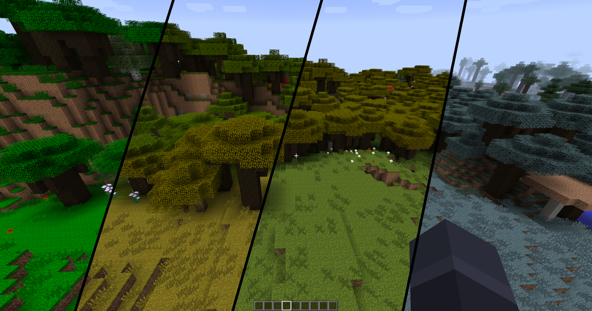

# Seasonal Horizons 🌱 ☀️ 🍂 ❄️

Seasonal Horizons brings a changing year to Minecraft 1.7.10 and GT New Horizons. Spring, summer, autumn, and winter are each divided into early, mid, and late subseasons, giving the world twelve distinct seasonal looks.

## What it does

- Gives every subseason its own grass and foliage colors.
- Makes winter colder, allowing snow to reach places that stay warm during the rest of the year.
- Accumulates and thaws snow gradually across the landscape instead of changing everything at once.
- Keeps unloaded and newly generated chunks consistent with the current snow state when they appear.
- Lays snow beneath leafy canopies as well as on exposed terrain.

Seasonal Horizons is still in development. The intended behavior and technical design live in [Concept.md](Concept.md), while known gaps and upcoming work are tracked in [Todo.md](Todo.md).

## License

Seasonal Horizons is licensed under the [GNU Lesser General Public License 2.1](LICENSE).
